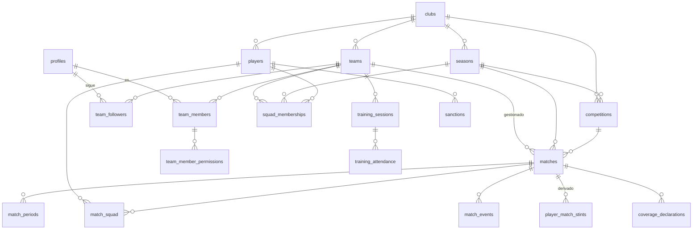

# DOC 05 — Modelo de datos y políticas RLS

> **Versión:** 1.15 — 08/10/2026 (§14.10: los entrenamientos solo los ve quien pasa lista, escrito y sin aplicar) · 1.14 — 07/10/2026 (§14.8 aplicada: el ensayo pasa contra Supabase y la migración entra sin cambiar el SQL, desde el SQL Editor) · 1.13 — 04/10/2026 (§14.9: Realtime para el directo, dos tablas en la publicación, escrito y sin aplicar) · 1.12 — 04/10/2026 (§14.8: seguir no se aprueba, el nombre real deja de salir por la API, ensayo pasado en local) · 1.11 — 04/10/2026 (§14.8: personas, invitaciones y solicitudes, escrita y sin aplicar) · 1.10 — 26/09/2026 (§14: los puntos del DOC 13 citados son de su día; §14.4 conectada en la T-203b) · 1.9 — 26/09/2026 (§14.4, §14.5 y §14.6 aplicadas en una sesión de Cowork; §14.7) · 1.8 — 26/09/2026 (§14.6: el estado del evento lo pone la base, hallazgo de la T-208) · 1.7 — 26/09/2026 (§14.5: lo que deja pendiente la T-205) · 1.6 — 26/09/2026 (§14.4: la próxima migración, para Cowork) · 1.5 — 26/09/2026 (§7.1: categoría y unicidad de `competitions`, hallazgos de la T-203) · 1.4 — 26/09/2026 (§12: `teams_insert` pide menos que la tabla, hallazgo de la T-201) · 1.3 — 19/09/2026 (endurecimiento de permisos sobre funciones) · 1.2 — 12/09/2026 (T-100b: migración de correcciones aplicada) · 1.1 el mismo día · 1.0 — 11/09/2026
> **Depende de:** DOC 04 (reglas de negocio), DOC 03 (decisiones)
> **Alimenta a:** DOC 06 (arquitectura frontend), DOC 08 (tareas), DOC 09 (observabilidad), DOC 10 (entornos)
> **Anexo:** `supabase/migrations/` — ocho archivos. El guion de creación es `20260911213846_initial_schema.sql`; el resto son correcciones y endurecimiento. Ver §14

---

## 1. Para qué sirve este documento

Describe cada tabla, cada relación y cada política de seguridad, con el porqué de cada decisión. El SQL del anexo es la implementación; este documento es el motivo.

**Proyecto de Supabase:** GavetaStats · región West EU (Irlanda) · plan gratuito.
La región es la correcta: Irlanda es lo más cercano a Canarias dentro de la UE, y mantiene los datos en territorio europeo, que es lo que pide el DOC 11.

---

## 2. Convenciones

| Convención            | Regla                                                                                                                              |
| :-------------------- | :--------------------------------------------------------------------------------------------------------------------------------- |
| **Idioma**            | Inglés en `snake_case` para tablas, columnas, enumeraciones y funciones (decisión H1)                                              |
| **Nombres de tabla**  | En plural: `matches`, `players`, `teams`                                                                                           |
| **Claves primarias**  | `uuid` generado con `gen_random_uuid()`. Nunca enteros correlativos: el dispositivo genera identificadores antes de tener conexión |
| **Fechas**            | `timestamptz` siempre. La app se usa en Canarias, que cambia de hora y no va en horario peninsular                                 |
| **Momentos de juego** | Nunca `timestamptz`: parte más segundos. Ver DOC 04 §5                                                                             |
| **Borrado**           | `on delete cascade` hacia abajo en la jerarquía, `on delete restrict` hacia los catálogos                                          |
| **Trazabilidad**      | `created_by`, `created_at`, `updated_at` en toda tabla con datos de negocio                                                        |
| **Enumeraciones**     | Tipos `enum` de PostgreSQL, no texto libre ni tablas de catálogo                                                                   |
| **Esquema**           | Todo en `public`. Las funciones auxiliares de seguridad, en `public` con `search_path` fijado                                      |

> **Sobre los enumerados.** Añadir un valor a un `enum` en PostgreSQL es barato y no bloquea; quitarlo no se puede. Por eso todos los tipos de evento nacen declarados aunque estén apagados (DOC 04 §7.1): así encender los pases o los tiros no requiere migración de tipo.

---

## 3. Mapa de entidades



La columna vertebral es `club → season → team → match → event`. Toda política de seguridad sube por esa cadena.

---

## 4. Enumeraciones

| Tipo                  | Valores                                                                                                                                                                                                                                                             |
| :-------------------- | :------------------------------------------------------------------------------------------------------------------------------------------------------------------------------------------------------------------------------------------------------------------ |
| `team_kind`           | `managed`, `reference`                                                                                                                                                                                                                                              |
| `team_role`           | `coach`, `delegate`, `scout`, `spectator`                                                                                                                                                                                                                           |
| `app_permission`      | `team.manage`, `roster.manage`, `competition.manage`, `schedule.manage`, `lineup.manage`, `match.live.write`, `event.approve`, `match.close`, `discipline.manage`, `training.manage`, `stats.view`, `members.manage`                                                |
| `competition_kind`    | `league`, `cup`, `friendly`                                                                                                                                                                                                                                         |
| `clock_mode`          | `running`, `stopped`                                                                                                                                                                                                                                                |
| `substitution_type`   | `fixed`, `rolling`                                                                                                                                                                                                                                                  |
| `match_status`        | `scheduled`, `called`, `live`, `suspended`, `finished`, `closed`                                                                                                                                                                                                    |
| `call_status`         | `starter`, `substitute`, `not_called`                                                                                                                                                                                                                               |
| `position_code`       | `GK`, `DF`, `MF`, `FW`                                                                                                                                                                                                                                              |
| `event_type`          | `goal`, `own_goal`, `yellow_card`, `second_yellow`, `red_card`, `foul_committed`, `foul_received`, `corner`, `substitution`, `position_change`, `note`, `pass`, `key_pass`, `shot_on_target`, `shot_off_target`, `offside`, `recovery`, `turnover`, `player_rating` |
| `event_status`        | `pending`, `approved`, `rejected`                                                                                                                                                                                                                                   |
| `stint_boundary`      | `period_start`, `period_end`, `substitution`, `sent_off`, `match_end`, `suspended`                                                                                                                                                                                  |
| `substitution_reason` | `tactical`, `fatigue`, `other`                                                                                                                                                                                                                                      |
| `coverage_scope`      | `full_team`, `single_player`, `goals_cards`, `custom`                                                                                                                                                                                                               |
| `availability_status` | `available`, `unavailable`, `sanctioned`                                                                                                                                                                                                                            |
| `sanction_type`       | `yellow_accumulation`, `red_card`, `club_decision`                                                                                                                                                                                                                  |
| `sanction_status`     | `proposed`, `active`, `served`, `cancelled`                                                                                                                                                                                                                         |
| `attendance_status`   | `present`, `absent`, `late`                                                                                                                                                                                                                                         |
| `invitation_status`   | `pending`, `accepted`, `revoked`, `expired`                                                                                                                                                                                                                         |

`substitution_reason` no incluye lesión. Es una decisión de privacidad, no un olvido (DOC 04 §12.4).

---

## 5. Identidad y organización

### 5.1 `profiles`

Espejo de `auth.users`. Supabase guarda las credenciales en su propio esquema; aquí vive lo que la aplicación necesita consultar y relacionar.

| Columna             | Tipo        | Notas                                             |
| :------------------ | :---------- | :------------------------------------------------ |
| `id`                | uuid PK     | Igual que `auth.users.id`, con borrado en cascada |
| `display_name`      | text        | Del perfil de Google                              |
| `avatar_url`        | text        | —                                                 |
| `is_platform_admin` | boolean     | Solo tú. Mantenimiento y registro de errores      |
| `created_at`        | timestamptz | —                                                 |

Una fila nace sola con cada alta, mediante un disparador sobre `auth.users`.

### 5.2 `clubs`

| Columna              | Tipo    | Notas                                                |
| :------------------- | :------ | :--------------------------------------------------- |
| `id`                 | uuid PK | —                                                    |
| `name`               | text    | —                                                    |
| `short_name`         | text    | Para cabeceras estrechas                             |
| `crest_url`          | text    | Ruta en Storage                                      |
| `home_venue`         | text    | Campo de casa. Nulable. Desde el §14.4               |
| `home_venue_address` | text    | Dirección del campo de casa. Nulable. Desde el §14.4 |
| `created_by`         | uuid    | → `profiles`                                         |

### 5.3 `seasons`

| Columna      | Tipo    | Notas                                             |
| :----------- | :------ | :------------------------------------------------ |
| `id`         | uuid PK | —                                                 |
| `club_id`    | uuid    | → `clubs`, cascada                                |
| `name`       | text    | `2026/27`. Único dentro del club                  |
| `starts_on`  | date    | —                                                 |
| `ends_on`    | date    | Posterior a `starts_on`                           |
| `is_current` | boolean | Solo una por club, garantizado por índice parcial |

La temporada pertenece al club y no es global: cada club decide sus fechas sin pisar a los demás.

### 5.4 `teams`

| Columna         | Tipo      | Notas                                                     |
| :-------------- | :-------- | :-------------------------------------------------------- |
| `id`            | uuid PK   | —                                                         |
| `club_id`       | uuid      | → `clubs`, cascada                                        |
| `name`          | text      | Único dentro del club                                     |
| `category`      | text      | `Cadete`, `Infantil`…                                     |
| `kind`          | team_kind | `managed` con plantilla, `reference` solo nombre y escudo |
| `crest_url`     | text      | —                                                         |
| `primary_color` | text      | Hexadecimal. Lo consume la variable CSS `--color-team`    |

**El equipo no lleva temporada.** El cadete sigue siendo el mismo equipo el año que viene; lo que cambia es su plantilla, y eso vive en `squad_memberships`.

> **Deuda técnica.** Los rivales se dan de alta dentro del club de Isaac. Si mañana otro club usa la aplicación, tendrá su propia copia del mismo rival. Resolverlo pide un catálogo global de equipos, que es trabajo de la fase multiclub (E17-03). Mientras haya un club, no molesta.

### 5.5 `team_members`

| Columna      | Tipo      | Notas                                        |
| :----------- | :-------- | :------------------------------------------- |
| `id`         | uuid PK   | —                                            |
| `team_id`    | uuid      | → `teams`, cascada                           |
| `user_id`    | uuid      | → `profiles`. Único junto con `team_id`      |
| `role`       | team_role | Etiqueta informativa y plantilla de permisos |
| `is_active`  | boolean   | Dar de baja sin perder el historial          |
| `invited_by` | uuid      | → `profiles`                                 |

### 5.6 `team_member_permissions`

Clave primaria compuesta por `team_member_id` y `permission`. **Los permisos son filas, no un rol rígido** (decisión C4): la matriz configurable del futuro será una pantalla, no una migración.

### 5.7 `team_followers`

| Columna      | Tipo | Notas                                        |
| :----------- | :--- | :------------------------------------------- |
| `team_id`    | uuid | → `teams`, cascada. Clave primaria compuesta |
| `user_id`    | uuid | → `profiles`                                 |
| `granted_by` | uuid | Quién le dio acceso                          |

Decisión H4. Solo lectura de datos aprobados, sin permisos y fuera de la pantalla de personas.

### 5.8 `invitations`

| Columna       | Tipo              | Notas                                       |
| :------------ | :---------------- | :------------------------------------------ |
| `id`          | uuid PK           | —                                           |
| `team_id`     | uuid              | → `teams`                                   |
| `email`       | text              | Correo al que se invita                     |
| `role`        | team_role         | Plantilla de permisos que se aplicará       |
| `permissions` | app_permission[]  | Permisos concretos, si se afinan al invitar |
| `as_follower` | boolean           | Si en lugar de miembro entra como seguidor  |
| `token`       | text              | Único                                       |
| `status`      | invitation_status | —                                           |
| `expires_at`  | timestamptz       | —                                           |

---

## 6. Plantilla

### 6.1 `players`

| Columna             | Tipo        | Notas                                                              |
| :------------------ | :---------- | :----------------------------------------------------------------- |
| `id`                | uuid PK     | —                                                                  |
| `club_id`           | uuid        | → `clubs`, cascada. **El jugador pertenece al club, no al equipo** |
| `nickname`          | text        | Identificación habitual. Obligatorio                               |
| `full_name`         | text        | **Nulo por defecto y oculto**                                      |
| `name_consent_at`   | timestamptz | Momento del consentimiento expreso                                 |
| `name_consent_note` | text        | Quién lo otorga y cómo                                             |
| `is_active`         | boolean     | —                                                                  |

Sin fecha de nacimiento, sin documento de identidad, sin fotografía, sin dato de salud. El nombre real solo se muestra con `name_consent_at` relleno, y una restricción impide guardarlo sin consentimiento.

### 6.2 `squad_memberships`

La inscripción de un jugador en un equipo durante una temporada.

| Columna            | Tipo                | Notas                                                     |
| :----------------- | :------------------ | :-------------------------------------------------------- |
| `id`               | uuid PK             | —                                                         |
| `team_id`          | uuid                | → `teams`                                                 |
| `season_id`        | uuid                | → `seasons`                                               |
| `player_id`        | uuid                | → `players`. Único junto con equipo y temporada           |
| `shirt_number`     | smallint            | De 1 a 99. Único por equipo y temporada entre los activos |
| `default_position` | position_code       | Posición habitual, distinta de la de cada partido         |
| `availability`     | availability_status | Condiciona la convocatoria                                |
| `joined_on`        | date                | —                                                         |
| `left_on`          | date                | Nulo mientras esté en la plantilla                        |

El dorsal vive aquí y no en el jugador: cambia de temporada en temporada y las estadísticas antiguas tienen que seguir mostrando el de entonces.

---

## 7. Competición

### 7.1 `competitions`

| Columna                 | Tipo              | Por defecto      |
| :---------------------- | :---------------- | :--------------- |
| `id`                    | uuid PK           | —                |
| `club_id`               | uuid              | —                |
| `season_id`             | uuid              | —                |
| `name`                  | text              | —                |
| `kind`                  | competition_kind  | `league`         |
| `periods_count`         | smallint          | 2                |
| `period_minutes`        | smallint          | 45               |
| `halftime_minutes`      | smallint          | 15               |
| `clock_mode`            | clock_mode        | `running`        |
| `substitution_type`     | substitution_type | `fixed`          |
| `substitutions_max`     | smallint          | 5                |
| `squad_max`             | smallint          | 18               |
| `players_on_pitch`      | smallint          | 11               |
| `yellow_cards_for_ban`  | smallint          | 5                |
| `red_card_default_bans` | smallint          | 1                |
| `enabled_event_types`   | event_type[]      | Los once del MVP |
| `category`              | text              | Nulo. `Cadete`   |
| `level`                 | text              | Nulo. `Primera`  |
| `scope`                 | text              | Nulo. `Tenerife` |
| `group_label`           | text              | Nulo. `G2`       |

Todo el reglamento del DOC 04 §4.1 en columnas explícitas y no en un JSON. Así se validan con restricciones y se consultan sin desempaquetar nada.

**Dos huecos que destapó la T-203.** No hay columnas de **categoría, nivel, ámbito ni grupo**: la federación nombra las ligas así («Cadete Primera Tenerife G2») y hoy todo va en `name`. Y **no hay unicidad de nombre** por club y temporada: la pantalla lo comprueba, la base no. **Los dos, cerrados el 26/09** con la migración del §14.4: las cuatro columnas de arriba y el índice único `competitions_name_unique` sobre `(club_id, season_id, lower(name))`. La A08 las lee y escribe desde la T-203b, opcionales, y `name` sigue siendo el nombre visible.

---

## 8. Partido

### 8.1 `matches`

| Columna                   | Tipo         | Notas                                                     |
| :------------------------ | :----------- | :-------------------------------------------------------- |
| `id`                      | uuid PK      | —                                                         |
| `club_id`                 | uuid         | Denormalizado a propósito: acorta todas las políticas RLS |
| `season_id`               | uuid         | → `seasons`                                               |
| `competition_id`          | uuid         | → `competitions`                                          |
| `team_id`                 | uuid         | Equipo gestionado                                         |
| `opponent_team_id`        | uuid         | Equipo referencia. Distinto de `team_id`                  |
| `is_home`                 | boolean      | —                                                         |
| `kickoff_at`              | timestamptz  | —                                                         |
| `venue`                   | text         | Campo y zona                                              |
| `status`                  | match_status | —                                                         |
| `is_retroactive`          | boolean      | Partido introducido en diferido                           |
| `suspended_period`        | smallint     | Solo si se suspendió                                      |
| `suspended_seconds`       | integer      | —                                                         |
| `confirmed_goals_for`     | smallint     | Resultado del acta, confirmado en el cierre               |
| `confirmed_goals_against` | smallint     | —                                                         |
| `closed_at` / `closed_by` | —            | Quién cerró y cuándo                                      |
| `notes`                   | text         | Comentarios generales del cierre                          |

El marcador calculado sale de los eventos (DOC 04 §7.3). El confirmado se guarda aparte porque es el del acta federativa, y cuando los dos difieren hay que poder verlo.

### 8.2 `match_periods`

| Columna           | Tipo        | Notas                                              |
| :---------------- | :---------- | :------------------------------------------------- |
| `match_id`        | uuid        | → `matches`, cascada                               |
| `period_number`   | smallint    | Único junto con el partido                         |
| `planned_seconds` | integer     | `period_minutes × 60` en el momento de abrirla     |
| `actual_seconds`  | integer     | **Manda en todos los cálculos**. Incluye descuento |
| `started_at`      | timestamptz | **Fuente de verdad del reloj** (DOC 04 §5.1.1)     |
| `ended_at`        | timestamptz | —                                                  |

Decisión H5: las partes no son eventos. Las escribe quien lleva el reloj, no entran en la cola de anotaciones y no admiten discordancia.

### 8.3 `match_squad`

| Columna        | Tipo          | Notas                            |
| :------------- | :------------ | :------------------------------- |
| `match_id`     | uuid          | → `matches`, cascada             |
| `player_id`    | uuid          | Único junto con el partido       |
| `call_status`  | call_status   | Titular, suplente o no convocado |
| `shirt_number` | smallint      | Dorsal de ese partido            |
| `position`     | position_code | Posición inicial de ese partido  |

### 8.4 `match_events`

El corazón del sistema. Una sola tabla para todos los tipos.

| Columna                       | Tipo         | Notas                                                                   |
| :---------------------------- | :----------- | :---------------------------------------------------------------------- |
| `id`                          | uuid PK      | —                                                                       |
| `client_event_id`             | uuid         | **Único.** Lo genera el dispositivo antes de enviar. Da idempotencia    |
| `match_id`                    | uuid         | → `matches`, cascada                                                    |
| `event_type`                  | event_type   | —                                                                       |
| `period`                      | smallint     | Entre 1 y el número de partes de la competición                         |
| `seconds`                     | integer      | Segundos dentro de esa parte. Nunca negativo. Derivado de `occurred_at` |
| `occurred_at`                 | timestamptz  | Instante del dispositivo. Nulo solo en partidos en diferido             |
| `is_opponent`                 | boolean      | Si el hecho es del rival                                                |
| `player_id`                   | uuid         | Nulo si es del rival                                                    |
| `secondary_player_id`         | uuid         | Asistente, o jugador que entra en una sustitución                       |
| `details`                     | jsonb        | Lo propio de cada tipo: motivo del cambio, posición nueva, texto        |
| `status`                      | event_status | —                                                                       |
| `duplicate_group_id`          | uuid         | Agrupa candidatos a duplicado                                           |
| `created_by`                  | uuid         | Quién lo apuntó                                                         |
| `reviewed_by` / `reviewed_at` | —            | Quién lo aprobó o rechazó                                               |

**Por qué una sola tabla y no una por tipo.** El directo escribe siempre la misma forma de fila, la cola offline reintenta un único tipo de operación, y las políticas de seguridad se escriben una vez. Tablas separadas obligarían a mantener trece colas, trece conjuntos de políticas y trece caminos de sincronización, que es justo lo que rompe a pie de campo.

Lo específico de cada tipo vive en `details`, que no se consulta para filtrar ni para agregar: los campos que alimentan estadísticas son columnas de verdad.

**Restricciones que impone la base de datos:**

| Restricción                                                                           | Invariante |
| :------------------------------------------------------------------------------------ | :--------- |
| Si `is_opponent`, entonces `player_id` es nulo                                        | —          |
| `goal`, `own_goal`, `foul_committed` y las tarjetas exigen jugador si no es del rival | I-04       |
| `substitution` exige jugador que sale y jugador que entra, y distintos                | —          |
| El jugador del evento está convocado en ese partido                                   | I-04       |
| `seconds` mayor o igual que cero, `period` mayor o igual que uno                      | I-02       |

### 8.5 `player_match_stints`

Tabla **derivada**. Nadie la edita a mano: la reconstruye la función `rebuild_match_stints` a partir de la convocatoria y los eventos aprobados (DOC 04 §6.1).

| Columna         | Tipo           | Notas                         |
| :-------------- | :------------- | :---------------------------- |
| `match_id`      | uuid           | —                             |
| `player_id`     | uuid           | —                             |
| `period`        | smallint       | El tramo nunca cruza de parte |
| `start_seconds` | integer        | —                             |
| `end_seconds`   | integer        | Mayor que `start_seconds`     |
| `start_reason`  | stint_boundary | —                             |
| `end_reason`    | stint_boundary | —                             |

Una restricción de exclusión impide que un mismo jugador tenga dos tramos solapados en la misma parte. Es el invariante I-03 vigilado por la base de datos, no por confianza.

### 8.6 `coverage_declarations`

| Columna                          | Tipo           | Notas                                                    |
| :------------------------------- | :------------- | :------------------------------------------------------- |
| `id`                             | uuid PK        | —                                                        |
| `match_id`                       | uuid           | → `matches`, cascada                                     |
| `user_id`                        | uuid           | Anotador                                                 |
| `scope`                          | coverage_scope | —                                                        |
| `target_player_id`               | uuid           | Obligatorio si el alcance es de un solo jugador          |
| `covered_event_types`            | event_type[]   | Se materializa al declarar, a partir del alcance elegido |
| `start_period` / `start_seconds` | —              | Desde cuándo sigue el partido                            |
| `end_period` / `end_seconds`     | —              | Nulos mientras siga dentro                               |
| `is_retroactive`                 | boolean        | Cobertura de un partido metido en diferido               |

Guardar la lista de tipos cubiertos, en vez de deducirla del alcance al leer, protege el histórico: si mañana cambia lo que significa `goals_cards`, las fiabilidades ya calculadas no se mueven.

---

## 9. Disciplina, entrenamientos y sistema

### 9.1 `sanctions`

| Columna                 | Tipo            | Notas                                              |
| :---------------------- | :-------------- | :------------------------------------------------- |
| `id`                    | uuid PK         | —                                                  |
| `club_id`               | uuid            | —                                                  |
| `player_id`             | uuid            | —                                                  |
| `season_id`             | uuid            | —                                                  |
| `competition_id`        | uuid            | Nulo si es decisión de club                        |
| `type`                  | sanction_type   | —                                                  |
| `matches_total`         | smallint        | **Editable a mano.** Lo dicta el comité, no la app |
| `matches_served`        | smallint        | —                                                  |
| `starts_on` / `ends_on` | date            | Para arrestos medidos en fechas y no en partidos   |
| `status`                | sanction_status | `proposed` hasta que el entrenador la confirma     |
| `origin_event_id`       | uuid            | La tarjeta que la originó                          |
| `notes`                 | text            | —                                                  |

Una restricción exige que la sanción se mida **o** en partidos **o** en fechas, nunca en nada.

### 9.2 `training_sessions` y `training_attendance`

Sesión con equipo, temporada, fecha, lugar y observación global. Asistencia con estado (presente, ausente, retraso) y observación por jugador, única por sesión y jugador.

### 9.3 `app_settings`

Tabla de clave y valor `jsonb` para las constantes que el DOC 04 pide configurables y que no pertenecen al reglamento.

Única entrada hoy: `duplicate_window_seconds`, que desde la migración del 12/09 es un mapa por tipo de evento y no un número (DOC 04 §9.2).

```json
{
  "default": 30,
  "by_type": {
    "goal": 30,
    "own_goal": 30,
    "yellow_card": 30,
    "second_yellow": 30,
    "red_card": 30,
    "corner": 10,
    "foul_committed": 10,
    "foul_received": 10
  }
}
```

`flag_duplicate_candidates` busca el tipo en `by_type` y, si no está, aplica `default`. Añadir un tipo con ventana propia es editar esta fila: no se despliega nada.

### 9.4 `audit_log`

| Columna      | Tipo  | Notas                                          |
| :----------- | :---- | :--------------------------------------------- |
| `table_name` | text  | —                                              |
| `record_id`  | uuid  | —                                              |
| `action`     | text  | `insert`, `update`, `delete`                   |
| `diff`       | jsonb | Solo los campos que cambiaron                  |
| `actor_id`   | uuid  | —                                              |
| `club_id`    | uuid  | Denormalizado para que la política sea directa |

Un disparador genérico lo rellena en las tablas sensibles: eventos, convocatoria, sanciones, permisos y partidos. Cubre E9-02.

### 9.5 `error_logs`

Ruta, mensaje, traza, datos del dispositivo, versión de la aplicación, usuario y club. **Nunca guarda el contenido del formulario que falló**, para no filtrar datos por la puerta de atrás. Cubre E12-01 y E12-03.

---

## 10. Índices

Además de los de clave primaria y unicidad:

| Índice                                                           | Para qué                                          |
| :--------------------------------------------------------------- | :------------------------------------------------ |
| `match_events (match_id, period, seconds)`                       | Cronología del partido y recálculo de tramos      |
| `match_events (match_id, status)`                                | Panel de discordancias                            |
| `match_events (player_id, event_type)` con estado aprobado       | Estadísticas de jugador                           |
| `match_events (client_event_id)` único                           | Idempotencia de la cola offline                   |
| `matches (team_id, season_id, status)`                           | Calendario y agregados de temporada               |
| `matches (club_id, kickoff_at)`                                  | Próximo evento en la pantalla de inicio           |
| `player_match_stints (match_id, player_id)`                      | Minutos                                           |
| `team_members (user_id)`                                         | **Crítico.** Lo consultan todas las políticas RLS |
| `team_member_permissions (team_member_id, permission)`           | **Crítico.** Idem                                 |
| `team_followers (user_id)`                                       | Idem                                              |
| `coverage_declarations (match_id)`                               | Cálculo de fiabilidad                             |
| `squad_memberships (team_id, season_id)` único por dorsal activo | I-05                                              |

Los tres marcados como críticos deciden el rendimiento de toda la aplicación: si una política tiene que recorrer la tabla de miembros en cada fila, se nota en cada pantalla.

---

## 11. La única puerta de lectura

El DOC 04 §14.2 lo exige y aquí se implementa: **ninguna pantalla agrega por su cuenta.**

| Objeto                           | Qué devuelve                                                   |
| :------------------------------- | :------------------------------------------------------------- |
| `v_match_scores`                 | Marcador calculado y confirmado de cada partido                |
| `v_player_match_minutes`         | Minutos y segundos por jugador y partido, desde los tramos     |
| `v_player_match_stats`           | Eventos aprobados agregados por jugador y partido              |
| `v_player_season_stats`          | Agregado de temporada, solo partidos cerrados                  |
| `v_team_season_stats`            | Agregado de equipo                                             |
| `metric_reliability(...)`        | Fiabilidad de una métrica en un partido, según DOC 04 §10.3    |
| `player_metric_reliability(...)` | Lo mismo para una métrica individual de un jugador             |
| `rebuild_match_stints(match_id)` | Reconstruye los tramos del partido                             |
| `flag_duplicate_candidates(...)` | Agrupa candidatos a duplicado dentro de la ventana configurada |

**Todas las vistas se crean con `security_invoker = true`.** Sin esa opción, una vista se ejecuta con los permisos de quien la creó y **se salta las políticas RLS de quien la consulta**: sería un agujero por el que un seguidor vería datos de otro club. Es el error más caro que se puede cometer en este modelo.

---

## 12. Seguridad a nivel de fila

### 12.1 Principio

**RLS activo en todas las tablas, sin excepción.** Una tabla sin RLS en un proyecto de Supabase es pública para cualquiera que tenga la `anon key`, que va en el frontend por diseño.

### 12.2 Funciones auxiliares

Las políticas no consultan `team_members` directamente: si lo hicieran, la política de `team_members` se consultaría a sí misma y PostgreSQL abortaría por recursión infinita. Se resuelve con funciones `security definer`, que se saltan la RLS de forma controlada:

| Función                                    | Devuelve                                                   |
| :----------------------------------------- | :--------------------------------------------------------- |
| `is_platform_admin()`                      | Si el usuario es administrador de la plataforma            |
| `is_team_member(team_id)`                  | Si tiene función activa en el equipo                       |
| `has_team_permission(team_id, permission)` | Si tiene ese permiso concreto en ese equipo                |
| `is_team_follower(team_id)`                | Si sigue el equipo                                         |
| `can_read_team(team_id)`                   | Miembro, seguidor o administrador                          |
| `is_club_member(club_id)`                  | Si tiene función en algún equipo del club                  |
| `team_of_match(match_id)`                  | El equipo gestionado del partido, para subir por la cadena |

Todas se declaran `stable` y con `search_path` fijado a `public`. Lo primero permite a PostgreSQL evaluarlas una vez por consulta en lugar de una vez por fila; lo segundo evita que alguien las engañe con un esquema falso.

### 12.3 Matriz de políticas

| Tabla                     | Lectura                                                                    | Escritura                                                                                          |
| :------------------------ | :------------------------------------------------------------------------- | :------------------------------------------------------------------------------------------------- |
| `profiles`                | El propio, y los miembros de sus equipos                                   | Solo el propio                                                                                     |
| `clubs`                   | Miembros y seguidores del club                                             | `team.manage` en algún equipo del club                                                             |
| `seasons`                 | Igual que el club                                                          | `competition.manage`                                                                               |
| `teams`                   | Miembros y seguidores                                                      | `team.manage`                                                                                      |
| `team_members`            | Miembros del equipo                                                        | `members.manage`                                                                                   |
| `team_member_permissions` | Miembros del equipo                                                        | `members.manage`                                                                                   |
| `team_followers`          | El propio y quien tenga `members.manage`                                   | `members.manage`                                                                                   |
| `invitations`             | `members.manage`                                                           | `members.manage`                                                                                   |
| `players`                 | Miembros del club y seguidores de un equipo donde el jugador esté inscrito | `roster.manage`                                                                                    |
| `squad_memberships`       | Miembros y seguidores del equipo                                           | `roster.manage`                                                                                    |
| `competitions`            | Miembros y seguidores                                                      | `competition.manage`                                                                               |
| `matches`                 | Miembros y seguidores                                                      | `schedule.manage`; el cierre exige `match.close`                                                   |
| `match_periods`           | Miembros y seguidores                                                      | `match.live.write`                                                                                 |
| `match_squad`             | Miembros y seguidores                                                      | `lineup.manage`                                                                                    |
| `match_events`            | Miembros ven todo; **seguidores solo los aprobados**                       | Insertar: `match.live.write`. Editar y borrar: el autor mientras esté pendiente, o `event.approve` |
| `player_match_stints`     | Miembros y seguidores                                                      | Nadie. Solo la función de recálculo                                                                |
| `coverage_declarations`   | Miembros                                                                   | La propia, con `match.live.write`                                                                  |
| `sanctions`               | Miembros                                                                   | `discipline.manage`                                                                                |
| `training_sessions`       | Miembros. **Con el §14.10 aplicado, solo `training.manage`**               | `training.manage`                                                                                  |
| `training_attendance`     | Miembros. **Con el §14.10 aplicado, solo `training.manage`**               | `training.manage`                                                                                  |
| `app_settings`            | Cualquiera autenticado                                                     | Administrador de la plataforma                                                                     |
| `audit_log`               | `members.manage` del club                                                  | Nadie. Solo los disparadores                                                                       |
| `error_logs`              | Administrador de la plataforma                                             | Cualquiera autenticado puede insertar los suyos                                                    |

**Ojo, que la tabla y la base no dicen lo mismo en `teams` (hallazgo de la T-201).** La tabla pide `team.manage` para escribir, y eso es lo que hace `teams_update`. Pero `teams_insert` solo pide `is_club_member(club_id)`: cualquier miembro activo de algún equipo del club, también un anotador o un espectador, puede dar de alta equipos llamando a la API. La interfaz solo enseña el alta a quien tiene `team.manage`. **Cerrado el 26/09** con la migración del §14.4: `teams_insert` pide ya `has_club_permission(club_id, 'team.manage')`.

Dos reglas merecen atención:

**El seguidor solo ve eventos aprobados.** Es la razón de ser de la separación entre miembros y seguidores: la grada no tiene por qué ver el barullo de discordancias sin resolver.

**Los tramos no los escribe nadie.** Ni el entrenador. Los escribe la función de recálculo, que se ejecuta con permisos elevados. Así se garantiza que los minutos siempre se corresponden con los eventos.

### 12.4 Lo que la RLS por sí sola no puede distinguir

Una política de actualización ve la fila vieja en su cláusula `using` y la nueva en su `with check`, pero **nunca las dos a la vez**. Por eso no puede diferenciar «empezar el partido» de «cerrar el partido»: las dos son una actualización de `matches` hecha por alguien con permiso de escritura.

La primera versión de estas políticas dejaba que un ojeador con `match.live.write` cerrara el partido y confirmara el resultado. Lo destapó la prueba de permisos, no la lectura del código.

Se resuelve con el disparador `enforce_match_changes`, que compara ambas versiones de la fila y exige el permiso que corresponde a cada cambio:

| Cambio                                    | Permiso exigido    |
| :---------------------------------------- | :----------------- |
| Cerrar o reabrir el partido               | `match.close`      |
| Confirmar el resultado del acta           | `match.close`      |
| Cambiar fecha, campo, rival o competición | `schedule.manage`  |
| Empezar, suspender o terminar el partido  | `match.live.write` |

La regla general que deja: **cuando un permiso depende de qué cambia y no de qué fila es, la RLS marca el perímetro y un disparador afina dentro.**

### 12.5 Lo que la RLS no resuelve

| Riesgo                                         | Mitigación                                                         |
| :--------------------------------------------- | :----------------------------------------------------------------- |
| La `anon key` va en el frontend                | Es pública por diseño. La RLS es la que protege, no la clave       |
| La clave `service_role` se salta toda la RLS   | **No sale del servidor jamás.** Ni en `.env.local` del frontend    |
| Un miembro con permiso puede borrar datos      | Queda en la auditoría. El borrado real se restringe donde se puede |
| Un fallo en una política abre datos de un club | Se prueba con dos clubes de mentira antes de meter datos reales    |

**Prueba obligatoria antes de la Fase 2:** crear un segundo club con otro usuario y comprobar que no ve absolutamente nada del primero. Sin esa prueba, la multitenencia es una intención.

**Hecha el 25/09/2026 (T-105b)** con `supabase/pruebas/aislamiento_clubes.sql`: 166 comprobaciones de lectura, escritura y RPC entre dos clubes sintéticos, sin fallos. **Se repite después de cada migración que toque políticas o funciones.** Queda un hueco de integridad, no de lectura: ninguna política exige que los objetos enlazados en una fila (jugador, rival, temporada, competición) sean del mismo club que la fila.

---

## 13. Almacenamiento

Dos cubos de Storage, ambos privados:

| Cubo     | Contenido                   | Acceso                                      |
| :------- | :-------------------------- | :------------------------------------------ |
| `crests` | Escudos de club y de equipo | Lectura para miembros y seguidores del club |
| `docs`   | Actas y fichas en fase 2    | Lectura para miembros con `match.close`     |

El acta es del cierre, así que su lectura sigue atada a `match.close` y no a `event.approve`.

**Ninguna fotografía de jugadores.** No existe el cubo que las guardaría.

---

## 14. Migraciones

Todo cambio de esquema entra como archivo de migración numerado en `supabase/migrations`, nunca escribiendo a mano en el panel de Supabase. El panel sirve para mirar, no para cambiar: lo que se toca ahí no queda en Git y se pierde al recrear el entorno.

**Nombres de archivo: marca de tiempo, no número correlativo.** El CLI de Supabase deriva la versión de la migración del prefijo del nombre, y el historial remoto guarda esa misma versión. Si los dos no coinciden, `supabase db push` da por aplicar migraciones que ya están dentro e intenta repetirlas.

| Archivo                                                      | Versión registrada | Qué hace                                                                                  |
| :----------------------------------------------------------- | :----------------- | :---------------------------------------------------------------------------------------- |
| `20260911213846_initial_schema.sql`                          | `20260911213846`   | Esquema inicial: el anexo de este documento                                               |
| `20260911214032_hardening_rls_y_permisos.sql`                | `20260911214032`   | Endurecimiento tras el primer auditor (ver más abajo)                                     |
| `20260912142001_permiso_event_approve.sql`                   | `20260912142001`   | Valor `event.approve` en `app_permission`                                                 |
| `20260912142131_correcciones_auditoria.sql`                  | `20260912142131`   | Correcciones de la auditoría del 12/09 (§14.2)                                            |
| `20260919040657_endurecimiento_permisos_funciones.sql`       | `20260919040657`   | Endurecimiento de permisos sobre funciones (§14.3)                                        |
| `20260925182524_guarda_permiso_funciones_partido.sql`        | `20260925182524`   | Guarda de permiso en `rebuild_match_stints` y `flag_duplicate_candidates` (T-105b)        |
| `20260926150907_competiciones_categoria_y_campo_de_casa.sql` | `20260926150907`   | Categoría de la competición, nombre único, campo de casa y dos permisos (§14.4)           |
| `20260926150926_guardas_convocatoria_y_estado_evento.sql`    | `20260926150926`   | `marcar_convocado()`, máximo de convocados y estado del evento en la base (§14.5 y §14.6) |

Las ocho están aplicadas al proyecto GavetaStats: las dos primeras desde el 11/09/2026, las dos del 12/09 en la T-100b, la del 19/09 fuera de tarea, como deuda arrastrada, la del 25/09 en la T-105b y las dos del 26/09 en una sesión de Cowork (§14.7). Las versiones registradas en el historial remoto coinciden con los prefijos de los archivos.

Las migraciones siguientes las crea el propio CLI con `supabase migration new <nombre>`, que pone la marca de tiempo sola. **Nunca renombres una migración ya aplicada**: el historial remoto dejaría de encontrarla.

**Los «puntos del DOC 13» de los apartados de abajo y de los comentarios de las migraciones son los de la numeración del día en que se escribieron.** El DOC 13 se renumera en cada sesión; para saber qué punto sigue abierto hoy, léelo a él. Las migraciones aplicadas no se tocan ni para esto.

### 14.1 Qué corrigió el endurecimiento

El auditor de Supabase destapó tres cosas al aplicar el esquema inicial, y una era un agujero:

- **Las funciones del proyecto eran ejecutables sin sesión.** El `revoke all on all functions ... from anon` del esquema inicial no bastaba: PostgreSQL concede `EXECUTE` a `PUBLIC` al crear cada función y `anon` lo hereda, así que revocar solo de `anon` no quita lo heredado. Cualquiera con la `anon key` podía llamar a `rebuild_match_stints` y a `flag_duplicate_candidates` por `/rest/v1/rpc` sin iniciar sesión, y las dos son `SECURITY DEFINER`: escriben saltándose la RLS. **Regla que deja: revocar de una función se hace siempre de `public` además de `anon`.**
- **`auth.uid()` se evaluaba por fila** en doce políticas. Envuelto en `(select auth.uid())` pasa a ser un InitPlan que el planificador resuelve una vez por consulta. En `match_events`, que es la tabla que crece, la diferencia se nota en la pantalla de directo.
- **`audit_row()` dejaba `club_id` nulo**, y la política `audit_log_select` lo exige para que quien tiene `members.manage` lea la auditoría de su club. Ahora el club se deduce de la fila auditada, del partido o del equipo, según la tabla.

---

### 14.2 Qué corrigió la migración del 12/09

Escrita, validada y aplicada en la T-100b contra el esquema real, no de memoria. Se reparte en dos archivos porque PostgreSQL no deja **usar** un valor de enumeración dentro de la misma transacción que lo crea: el `event.approve` va solo en el primero y las políticas que lo citan viven en el segundo.

| Cambio                                                                                                          | Origen                     |
| :-------------------------------------------------------------------------------------------------------------- | :------------------------- |
| Columna `occurred_at` en `match_events`; `seconds` admite nulo y lo rellenan dos disparadores                   | A-01                       |
| `rebuild_match_stints` ignora la sustitución cuyo jugador entrante ya tiene tramo abierto en esa parte          | A-03                       |
| `players_select` admite seguidores de un equipo donde el jugador esté inscrito                                  | A-05                       |
| `metric_reliability` pasa a la fórmula corregida del DOC 04 §10.3                                               | A-07                       |
| `duplicate_window_seconds` pasa de número a mapa por tipo, y `flag_duplicate_candidates` lo consulta por evento | A-08                       |
| Valor `event.approve`, y `match_events_update` / `match_events_delete` pasan a citarlo en vez de `match.close`  | Reparto del día de partido |

**Tres decisiones que la migración tomó y que el §14.2 anterior dejaba abiertas:**

- **El reloj se rellena en los dos sentidos.** El §14.2 pedía un disparador «al llegar» el evento, y ese resuelve la mitad: si el evento llega antes de que se sincronice `started_at`, no hay de dónde calcular los segundos y el evento se queda sin cronología para siempre. Es justo el caso del anotador sin cobertura durante el arranque, que es para quien existe toda la capa offline. Van dos disparadores: `match_events_set_seconds` al llegar el evento y `match_periods_backfill_seconds` al escribir el arranque de la parte.
- **El descarte de la sustitución repetida se devuelve, no se persiste.** El DOC 04 §6.3 pide que el descarte «se registre» sin decir dónde. `rebuild_match_stints` cambia su retorno de `integer` a `jsonb` y devuelve `{"stints": n, "skipped": [ids]}`. Las otras dos salidas se descartaron: escribir en `match_events.details` obliga a cada recálculo a disparar `validate_match_event`, `set_updated_at` y `audit_row` sobre el evento, y llena la auditoría del partido de ruido que nadie provocó; escribir en `audit_log` deja el descarte donde el panel de discordancias no mira y donde la RLS exige `members.manage`, que el anotador puede no tener. Romper la firma sale gratis hoy —no la llama nadie— y caro en noviembre. Cuando exista el panel (T-210) se decide si hace falta persistirlo.
- **La lectura de `players` se afina, no se amplía.** `can_read_club` ya dejaba leer la plantilla entera del club a cualquier seguidor de cualquier equipo del club, así que el A-05 tal como está resumido en el DOC 13 del 12/09 estaba mal enunciado: no era que el seguidor no pudiera leer, era que leía de más. La política nueva sigue al pie de la letra el §12.3: miembros del club, y seguidores de un equipo donde el jugador esté inscrito.

**La regla del endurecimiento que esta migración vuelve a aplicar.** PostgreSQL concede `EXECUTE` a `PUBLIC` al **crear** una función. `CREATE OR REPLACE` conserva los permisos; `DROP` + `CREATE` los pierde y la función renace abierta a `anon`. Las tres funciones que aquí nacen o renacen enteras —`set_event_seconds`, `backfill_event_seconds` y `rebuild_match_stints`— llevan su `revoke ... from public, anon` detrás. `metric_reliability` y `flag_duplicate_candidates` se reemplazan con la misma firma y conservan los suyos.

**Al sembrar los permisos a mano, quien tenga `match.close` necesita también `event.approve`** si va a corregir eventos ajenos. Son dos permisos desde esta migración, y `match.close` ya no da acceso a `match_events`.

---

### 14.3 Qué endureció la migración del 19/09

No sale de ninguna tarea del DOC 08: son los puntos 3 y 4 de «lo que sigue abierto» del DOC 13, abiertos desde la T-100b. La migración solo toca permisos —ni una definición de función, ni una política, ni una columna— y se aplicó a producción antes de fusionar, porque no hay entorno de pruebas.

| Cambio                                                                        | Origen                 |
| :---------------------------------------------------------------------------- | :--------------------- |
| `rls_auto_enable()` pierde el `EXECUTE` de `public`, `anon` y `authenticated` | Aviso 0028 del auditor |
| Las siete funciones de disparador pierden el `EXECUTE` de `authenticated`     | Aviso 0029 del auditor |

**El punto 3 no obligaba a meter en el repositorio una función que gestiona Supabase**, que era la pega que lo tenía parado desde el 12/09. `REVOKE` trabaja sobre la firma y no sobre el cuerpo: se revoca sin redefinir nada. Cuando una salida parece cara, conviene mirar si la operación necesita de verdad lo que se le supone.

**Revocar solo de `anon` no habría servido de nada, y esto es lo que de verdad importa del punto 3.** La ACL de la función era `=X/postgres | postgres=X/postgres | authenticated=X/postgres | service_role=X/postgres`, y ese `=X` sin nombre delante es PUBLIC. El permiso de `anon` era el de PUBLIC, no una concesión suya, así que un `revoke ... from anon` habría dejado el aviso donde estaba. Es la regla del §14.1 otra vez: **revocar de una función se hace siempre de `public` además de `anon`**. Van tres veces que la misma trampa aparece en este proyecto.

**Revocar el `EXECUTE` de una función de disparador no rompe el disparador.** PostgreSQL lo comprueba al crear el disparador, no al dispararlo: de ahí en adelante la llamada la hace el motor y no consulta la ACL. Se comprobó antes de aplicar, no se supuso: un disparador `BEFORE INSERT` cuya función no tenía `EXECUTE` ni para PUBLIC ni para `authenticated` saltó igual al insertar con `set local role authenticated`. Lo mismo vale para el disparador de eventos `ensure_rls`, que invoca a `rls_auto_enable()` al final de cada DDL y que después del revoke sigue activando la RLS en cada tabla nueva de `public`.

**Antes y después, medido sobre la base de producción.** Las ocho funciones pasan de tener `authenticated=X` —y PUBLIC en el caso de `rls_auto_enable`— a quedarse en `postgres=X | service_role=X`. `has_function_privilege` da falso para `anon` y para `authenticated` en las ocho. El auditor pasa de un hallazgo 0028 a ninguno y de diecinueve hallazgos 0029 a once. Los veintiocho disparadores siguen activos, las ocho huellas `md5(prosrc)` son idénticas antes y después, y los tipos generados coinciden byte a byte con los del repositorio, que es lo que se espera de una migración de solo permisos.

**Lo que el aviso 0029 sigue marcando se queda a propósito.** Las once funciones que quedan —`can_read_club`, `can_read_team`, `has_club_permission`, `has_team_permission`, `is_club_member`, `is_platform_admin`, `is_team_follower`, `is_team_member`, `team_of_match`, `rebuild_match_stints` y `flag_duplicate_candidates`— necesitan ese `EXECUTE`: las llaman las políticas RLS y el cliente. Ahí el aviso es informativo.

**Queda una línea pendiente.** `set_updated_at()` es la octava función de disparador y arrastra el mismo `EXECUTE` de `authenticated` que sobra. No entró aquí porque el auditor no la marca —es `SECURITY INVOKER`, así que llamarla a mano no salta la RLS— y porque el alcance eran los siete del DOC 13. **Cerrada el 26/09** con la pieza 4b del §14.4.

**Si Supabase recrea `rls_auto_enable()` con `DROP` + `CREATE`, el permiso de PUBLIC vuelve** y el aviso 0028 con él. `CREATE OR REPLACE` conserva la ACL; un `DROP` no. Merece una mirada al auditor después de cada actualización de la plataforma.

### 14.4 Categoría, nombre único y campo de casa: aplicada el 26/09

Decidida por Raúl el 26/09/2026, tras la T-203. **Aplicada ese mismo día en una sesión de Cowork**, como `20260926150907_competiciones_categoria_y_campo_de_casa.sql`, con el borrador de abajo tal cual y dos retoques: comentarios en las seis columnas nuevas, y el `revoke` de la pieza 4b también de `public` y `anon` (regla del §14.1). El campo de casa del C.D. Unión Tejina ya está en su fila. Lo que se midió, en el §14.7. Cuatro piezas, ninguna destructiva.

| Pieza                                                  | Qué hace                                                                                       | Origen                                |
| :----------------------------------------------------- | :--------------------------------------------------------------------------------------------- | :------------------------------------ |
| **1. Categoría de la competición en columnas propias** | `competitions` gana `category`, `level`, `scope` y `group_label`, las cuatro `text` y nulables | Decisión de Raúl, punto 33 del DOC 13 |
| **2. Nombre único por club y temporada**               | Índice único sobre `(club_id, season_id, lower(name))`                                         | Decisión de Raúl, punto 34            |
| **3. Campo de casa del club**                          | `clubs` gana `home_venue` y `home_venue_address`, `text` y nulables                            | Dato de Raúl, punto 37                |
| **4. Dos líneas de permisos pendientes**               | `teams_insert` pide `team.manage`; `set_updated_at()` pierde el `EXECUTE` de `authenticated`   | Puntos 27 y 4 del DOC 13              |

**Las cuatro columnas de la categoría siguen cómo nombra la federación sus ligas.** Para el Cadete A: `category = 'Cadete'`, `level = 'Primera'`, `scope = 'Tenerife'`, `group_label = 'G2'`. El orden de la federación en Tenerife, de más a menos, es Autonómico Canarias, Provincial Tenerife, Preferente (G1 a G3) y Primera (G1 a G7). `name` se queda como nombre visible y no se deriva de las columnas: una copa o un torneo de verano no tiene grupo, y obligar a componerlo rompería esos casos. Texto libre y sin `check` a propósito: los niveles cambian de una federación a otra y de un año a otro, y una lista cerrada en la base sería una migración cada vez.

**El nombre único va con `lower()`**, igual que la comprobación de la A08: «Cadete Primera Tenerife G2» y «cadete primera tenerife g2» son la misma liga. **Antes de crear el índice hay que mirar si ya hay duplicados**, porque si los hay la migración falla entera:

```sql
select club_id, season_id, lower(name), count(*)
  from public.competitions
 group by 1, 2, 3
having count(*) > 1;
```

**El campo de casa** es el que dio Raúl para el C.D. Unión Tejina: **Campo de Fútbol Izquierdo Rodríguez**, Av. Milán, 27-29, 38260 La Laguna, Santa Cruz de Tenerife. Va en `clubs` y no en el código: la aplicación es multiclub desde el MVP y cada club tiene el suyo. La migración deja las columnas; el valor se rellena con un `update` aparte, en la misma sesión, como dato y no como esquema.

Borrador para revisar en la sesión, no para lanzar a ciegas:

```sql
-- 1. Categoría de la competición
alter table public.competitions
  add column category    text,
  add column level       text,
  add column scope       text,
  add column group_label text;

-- 2. Nombre único por club y temporada, sin distinguir mayúsculas
create unique index competitions_name_unique
  on public.competitions (club_id, season_id, lower(name));

-- 3. Campo de casa del club
alter table public.clubs
  add column home_venue         text,
  add column home_venue_address text;

-- 4a. Crear equipos exige team.manage (hoy basta con ser miembro del club)
drop policy teams_insert on public.teams;
create policy teams_insert on public.teams for insert to authenticated
  with check (public.has_club_permission(club_id, 'team.manage'));

-- 4b. set_updated_at() no necesita EXECUTE para authenticated
revoke execute on function public.set_updated_at() from authenticated;
```

Y el dato, aparte:

```sql
update public.clubs
   set home_venue = 'Campo de Fútbol Izquierdo Rodríguez',
       home_venue_address = 'Av. Milán, 27-29, 38260 La Laguna, Santa Cruz de Tenerife'
 where name ilike '%tejina%';
```

**Después de aplicarla:** `npm run db:types` para regenerar `src/types/database.types.ts` (con copia antes, punto 3 del DOC 13), relanzar el script de la T-105b y mirar el auditor. **El código que la aprovecha es la T-203b** del DOC 08, **hecha el 26/09**: los cuatro campos de categoría en la A08 y el campo de casa propuesto desde `clubs` en la A10. `home_venue_address` se lee y no se usa todavía, y la A03 no edita el campo de casa (DOC 13).

### 14.5 Lo que dejó pendiente la T-205: 5a y 5b aplicadas el 26/09

Hallazgos al escribir la A11 (26/09/2026). **La 5a y la 5b están aplicadas** desde el 26/09, en `20260926150926_guardas_convocatoria_y_estado_evento.sql`, junto con el §14.6. **La 5c queda fuera** (§14.7). Una diferencia con el borrador de abajo: `marcar_convocado()` devuelve `boolean` —`true` si cambió el partido— en vez de lanzar un error cuando ya ha empezado, para que `marcarComoConvocado` conserve su contrato (`SIN_FILAS`) sin distinguir errores por el texto. `check_squad_max()` lanza con el código `check_violation` (23514).

| Pieza                                               | Qué pasa hoy                                                                                                                                                                              | Propuesta                                                                                                                                     |
| :-------------------------------------------------- | :---------------------------------------------------------------------------------------------------------------------------------------------------------------------------------------- | :-------------------------------------------------------------------------------------------------------------------------------------------- |
| **5a. Pasar a `called` con `lineup.manage`** (L-07) | `matches_update` pide `schedule.manage`, `match.live.write` o `match.close`. Quien solo tiene `lineup.manage` guarda la convocatoria, pero el partido sigue «Programado». La A11 lo avisa | Función `marcar_convocado(match_id)` `SECURITY DEFINER`. **Recomendada**                                                                      |
| **5b. R-01 en la base**                             | El DOC 04 §4.3 dice que el máximo de convocados se comprueba «en la pantalla A11 y en la base de datos». En la base no hay nada: solo la A11 lo impide                                    | Disparador de sentencia `after insert or update` sobre `match_squad`, que cuente los convocados del partido al terminar                       |
| **5c. Dorsal repetido entre convocados** (opcional) | `match_squad` no impide que dos convocados del mismo partido lleven el mismo dorsal. Lo impide la A11                                                                                     | Restricción de exclusión diferible, no índice único: un índice parcial no se puede diferir y un cambio de dorsales entre dos chocaría a mitad |

**5a, por qué una función y no abrir la política.** Añadir `lineup.manage` a `matches_update` dejaría a quien solo convoca cambiar `notes`, `is_retroactive` o `suspended_*`, que `enforce_match_changes` no vigila. La función hace una sola cosa: con `lineup.manage` en el equipo del partido, pasa de `scheduled` a `called` y de nada más.

```sql
create or replace function public.marcar_convocado(p_match_id uuid)
returns void language plpgsql security definer set search_path = public
as $$
begin
  if not public.has_team_permission(public.team_of_match(p_match_id), 'lineup.manage') then
    raise exception insufficient_privilege
      using message = 'Convocar exige el permiso lineup.manage';
  end if;

  update public.matches set status = 'called'
   where id = p_match_id and status in ('scheduled', 'called');

  if not found then
    raise exception 'El partido ya ha empezado o no existe';
  end if;
end;
$$;

revoke execute on function public.marcar_convocado(uuid) from public, anon;
grant execute on function public.marcar_convocado(uuid) to authenticated;
```

Con la función aplicada, `marcarComoConvocado` de `agenda/api/partidos.ts` pasa a llamar a `supabase.rpc('marcar_convocado', …)`. Es un cambio de una función y su prueba.

**5b, por qué de sentencia y no de fila.** La A11 guarda la convocatoria entera de una vez. Un disparador de fila cuenta a mitad de la escritura, y cambiar un convocado por otro con la convocatoria llena pasaría un instante por un convocado de más. Contando al final de la sentencia, solo ve el resultado. La A11 ya crea las líneas nuevas sin convocar en una primera petición y les pone su llamada en la segunda, así que entre las dos la base nunca ve más convocados que antes ni que después.

```sql
create or replace function public.check_squad_max()
returns trigger language plpgsql security definer set search_path = public
as $$
declare
  v_fuera record;
begin
  select s.match_id, c.squad_max, count(*) as convocados
    into v_fuera
    from public.match_squad s
    join public.matches m      on m.id = s.match_id
    join public.competitions c on c.id = m.competition_id
   where s.match_id in (select match_id from nuevas)
     and s.call_status <> 'not_called'
   group by s.match_id, c.squad_max
  having count(*) > c.squad_max
   limit 1;

  if found then
    raise exception 'La convocatoria supera los % convocados permitidos', v_fuera.squad_max;
  end if;

  return null;
end;
$$;

create trigger match_squad_max_insert
  after insert on public.match_squad
  referencing new table as nuevas
  for each statement execute function public.check_squad_max();

create trigger match_squad_max_update
  after update on public.match_squad
  referencing new table as nuevas
  for each statement execute function public.check_squad_max();

revoke execute on function public.check_squad_max() from public, anon, authenticated;
```

Un `upsert` de PostgREST es un `insert … on conflict do update`: dispara el de `insert`, y también el de `update` si actualiza alguna fila. Hay que comprobar en la sesión que los dos ven sus filas en `nuevas`. **Después**, igual que el §14.4: `npm run db:types` con copia antes, el script de la T-105b y el auditor.

### 14.6 Lo que dejó pendiente la T-208: el estado del evento lo pone la base

Hallazgo al escribir la botonera (26/09/2026). **Aplicado el 26/09**, con el SQL de abajo tal cual, en la misma migración que la 5a y la 5b.

El DOC 04 §8.3 dice que quien tiene `event.approve` registra eventos que nacen `approved` y todos los demás `pending`. **La base no lo imponía**: `match_events_insert` solo comprueba `created_by = auth.uid()` y `match.live.write`, y `status` llegaba tal cual. La A12 manda `approved` solo a quien tiene el permiso, pero un cliente modificado, o un error en la pantalla, podría meter eventos aprobados sin tenerlo, y esos cuentan en las estadísticas sin pasar por nadie.

Propuesta: un disparador `before insert` que fije el estado según el permiso, sin mirar lo que llega.

```sql
create or replace function public.set_event_status()
returns trigger language plpgsql security definer set search_path = public
as $$
begin
  -- Sin sesión es el servidor: se respeta lo que llega.
  if auth.uid() is null then
    return new;
  end if;

  new.status := case
    when public.has_team_permission(public.team_of_match(new.match_id), 'event.approve')
      then 'approved'::event_status
    else 'pending'::event_status
  end;

  return new;
end;
$$;

-- Nombre con «a» delante para que corra antes que set_seconds y validate
-- (los disparadores de un mismo evento van en orden alfabético).
create trigger match_events_a_set_status
  before insert on public.match_events
  for each row execute function public.set_event_status();

revoke execute on function public.set_event_status() from public, anon, authenticated;
```

La A12 no cambia: sigue mandando el mismo `status`, y la base pasa a ser la que manda. **Después**, igual que el §14.4: `npm run db:types`, el script de la T-105b y el auditor.

### 14.7 Lo que se midió al aplicar el §14.4, el §14.5 y el §14.6

Sesión de Cowork del 26/09/2026, sobre la base de producción, con el MCP de Supabase. Dos migraciones, cada una en su transacción: la del §14.4 y otra con el §14.5 y el §14.6.

**Antes.** Ninguna competición con nombre repetido (la tabla estaba vacía: el Cadete A aún no tiene competiciones dadas de alta), una sola fila de club que casa con «tejina», y el auditor con los hallazgos de siempre: `btree_gist` en `public`, once 0029 y la protección de contraseñas filtradas apagada.

**Pruebas funcionales, en una transacción que termina en error y lo deshace todo.** Tres usuarios sintéticos por la RLS (`set local role authenticated` y su `sub`): U con `lineup.manage` y `match.live.write`, V con `match.live.write` y `event.approve`, W con `team.manage`. Resultado, todo como se esperaba:

| Comprobación                                                              | Resultado                             |
| :------------------------------------------------------------------------ | :------------------------------------ |
| Competición con el mismo nombre en otras mayúsculas                       | Rechazada, 23505                      |
| Guardar la convocatoria como la A11 (dos `upsert`), 5 de 5 convocados     | Pasa                                  |
| Sexto convocado por `upsert` de todas, por `upsert` de una y por `update` | Rechazado, 23514, en los tres caminos |
| Cambiar uno por otro con la convocatoria llena, en un solo `upsert`       | Pasa                                  |
| `marcar_convocado` de U, dos veces                                        | `true` y `true`; el partido, `called` |
| `marcar_convocado` con el partido en juego                                | `false`, sin tocarlo                  |
| `marcar_convocado` de V, sin `lineup.manage`                              | Rechazado, 42501                      |
| Evento de U mandado `approved`                                            | Entra `pending`                       |
| Evento de V mandado `pending`                                             | Entra `approved`                      |
| Evento sin sesión mandado `approved`                                      | Se respeta                            |
| Equipo nuevo de U, sin `team.manage`                                      | Rechazado, 42501                      |
| Equipo nuevo de W, con `team.manage`                                      | Pasa                                  |

Con esto queda comprobado lo que el §14.5 dejaba en el aire: **un `upsert` dispara los dos disparadores de sentencia y cada uno ve sus filas en `nuevas`**.

**Después.** El script de la T-105b, con `marcar_convocado` añadido a las funciones que se llaman sobre un partido ajeno: **SUPERADA, 168 comprobaciones, 0 fallos y los mismos 14 avisos** de siempre (punto 17 del DOC 13). `clubs`, `teams`, `team_members` y `auth.users` cuentan lo mismo antes y después (1, 1, 1 y 2). `check_squad_max`, `set_event_status` y `set_updated_at` se quedan en `postgres=X | service_role=X`; `marcar_convocado`, además, en `authenticated`. Los tipos de `src/types/database.types.ts` coinciden byte a byte con los que genera el MCP.

**El auditor suma un 0029, y es a propósito.** `marcar_convocado` es `SECURITY DEFINER` y la llama el cliente: necesita el `EXECUTE` de `authenticated`, como las once que ya lo marcaban (§14.3). Pasa de once a doce. Ningún hallazgo más.

**Dos matices de `marcar_convocado` que salieron en la revisión.** Con un partido que no existe no devuelve `false`, como dice el comentario de la migración, sino que lanza 42501: `team_of_match` da nulo y no hay equipo en el que tener permiso. El cliente trata los dos casos igual, así que no cambia nada; el archivo se deja tal como se aplicó y el JSDoc de `marcarComoConvocado` dice lo que pasa de verdad. Y, a diferencia de `enforce_match_changes` o `set_event_status`, **sin sesión no deja pasar**: también lanza 42501. Es más estricto que el patrón del resto y no molesta, porque solo la llama el cliente.

**La 5c se queda fuera.** Es opcional, la A11 ya lo impide, y una restricción de exclusión diferible cambia cuándo falla la escritura: con la A11 guardando en dos peticiones, cada una en su transacción, habría que probarla contra la pantalla de verdad, con un navegador, antes de meterla en producción. Si algún día se escribe en `match_squad` desde otro sitio, se retoma.

---

### 14.8 Personas: invitaciones, seguir y solicitudes de permisos — aplicada el 07/10/2026

Decisión I1 del DOC 03, cerrada por Raúl el 04/10/2026: **seguir a un equipo no necesita aprobación**. La aplica la T-301a. **Aplicada el 07/10/2026, sin cambiar una línea del SQL.** Antes pasó el ensayo contra la base de Supabase, con su esquema `auth` de verdad y sus permisos por defecto: terminó en `ENSAYO_CORRECTO: 18 pruebas, nada aplicado` y no dejó nada. El 04/10 había pasado en un PostgreSQL local (PGlite). Quitarle a la migración la comprobación de la lista o el cierre del nombre real hace fallar el ensayo, así que las pruebas muerden.

**Cómo se aplicó.** La herramienta de Supabase canceló el ensayo sin enseñar ninguna confirmación, así que el ensayo y la migración los lanzó Raúl desde el SQL Editor. La migración fue dentro de un solo bloque `do`, la misma forma que prueba el ensayo, con una última sentencia que la apunta en `supabase_migrations.schema_migrations` como `20261007184030`: o entraba todo o nada. Al ir pegada desde Windows, el código guardado de las doce funciones lleva saltos de línea CRLF; no cambia lo que hacen.

| Comprobación tras aplicar                  | Resultado                                                                                                                |
| :----------------------------------------- | :----------------------------------------------------------------------------------------------------------------------- |
| `teams.accepts_requests`                   | `false` en los 13 equipos                                                                                                |
| Filas en `access_requests`                 | 0                                                                                                                        |
| Las doce funciones                         | Existen, todas `SECURITY DEFINER`; `anon` no ejecuta ninguna                                                             |
| `correo_actual` e `invitations_normalizar` | Tampoco las ejecuta `authenticated`                                                                                      |
| Políticas de `access_requests`             | Una, de `SELECT`, para `authenticated`                                                                                   |
| `authenticated` sobre `players`            | Lee `nickname`; no lee `full_name` ni las dos del consentimiento                                                         |
| Informe de seguridad                       | Los avisos 0029 pasan de 12 a 22: las diez funciones que `authenticated` llama, a propósito. Ninguno de otro tipo        |
| Tipos                                      | Regenerados con la herramienta de Supabase: solo añaden lo nuevo, y `token` pasa a opcional al insertar en `invitations` |

| Archivo                                                         | Qué es                                                                                                       |
| :-------------------------------------------------------------- | :----------------------------------------------------------------------------------------------------------- |
| `supabase/migrations/20261007184030_personas_y_solicitudes.sql` | La migración, aplicada                                                                                       |
| `supabase/pruebas/personas_ensayo.sql`                          | La misma migración más 18 comprobaciones, dentro de un bloque que termina en error a propósito: no deja nada |

**Tres maneras de llegar a un equipo.**

| Puerta         | Quién empieza          | Cómo                                                                                                                                                                                                  |
| :------------- | :--------------------- | :---------------------------------------------------------------------------------------------------------------------------------------------------------------------------------------------------- |
| **Invitación** | Quien lleva el equipo  | Una fila en `invitations` con el correo, el rol y los permisos. La cuenta de Google con ese correo la ve al entrar (`mis_invitaciones`) y la acepta (`aceptar_invitacion`). No se envía ningún correo |
| **Seguir**     | Quien tiene una cuenta | Ve los equipos con `teams.accepts_requests` (`equipos_que_admiten_solicitudes`) y sigue el que quiera (`seguir_equipo`). **Es inmediato: no lo aprueba nadie.** El seguidor solo lee                  |
| **Solicitud**  | Quien quiere anotar    | Sobre un equipo de la lista, pide permisos (`solicitar_acceso`), y quien tiene `members.manage` resuelve (`resolver_solicitud`) eligiendo rol y permisos                                              |

**Lo que añade.**

| Pieza                                              | Detalle                                                                                                                                                 |
| :------------------------------------------------- | :------------------------------------------------------------------------------------------------------------------------------------------------------ |
| `teams.accepts_requests`                           | `boolean`, `false` por defecto: un equipo de menores no sale en ninguna lista, ni se le sigue ni se le pide nada, hasta que quien lo lleva lo enciende  |
| `invitations`                                      | El `token` se genera solo; un disparador normaliza el correo y pone `created_by`; índice único de una pendiente por equipo y correo                     |
| `access_requests`                                  | Equipo, usuario, mensaje de hasta 280 caracteres, `status` (`pending`, `approved`, `rejected`, `cancelled`), quién y cuándo resolvió. Solo de permisos  |
| RLS de `access_requests`                           | Solo lectura por política: la propia, o las del equipo con `members.manage`. **Ninguna política de escritura**: se escribe por las funciones            |
| `seguir_equipo` y `dejar_de_seguir`                | Lo que el seguidor hace por su cuenta. Seguir exige que el equipo esté en la lista y no ser ya miembro                                                  |
| `solicitudes_del_equipo` y `seguidores_del_equipo` | Con el nombre de la persona: `profiles_select` solo enseña a los compañeros, y quien pide o sigue no lo es                                              |
| `cancelar_solicitud`                               | Lo único que quien pide puede deshacer por su cuenta                                                                                                    |
| Permisos de columna en `players`                   | `authenticated` deja de leer `full_name`, `name_consent_at` y `name_consent_note`. Lee `id`, `club_id`, `nickname`, `is_active` y las tres de auditoría |

**Por qué se cierra el nombre real.** La política `players_select` deja leer la fila del jugador a quien sigue al equipo (decisión H4), y los permisos de la tabla dejaban leer todas sus columnas. Mientras alguien aprobaba a cada seguidor, eso era un riesgo acotado; con seguir libre, cualquier cuenta de Google podría pedir `full_name` por la API de un equipo de la lista. Hoy la columna está vacía en todos los jugadores y la aplicación nunca la ha pedido (T-202). El día que se active el nombre real con su consentimiento, saldrá por una función que lo compruebe, no por la tabla.

**Reglas que imponen las funciones.** Para tener permisos hace falta que alguien acepte; para seguir, que el equipo esté en la lista. Una invitación solo la acepta la cuenta cuyo correo coincide. Quien ya es miembro no baja a seguidor, y quien pasa a miembro deja de ser seguidor (DOC 04 §15.3). Una solicitud pendiente por equipo y persona, y tras un rechazo, una semana sin volver a pedir; el rechazado sigue pudiendo seguir. Todas las funciones son `SECURITY DEFINER` con `search_path` fijo, sin permiso para `anon`.

**Lo que no hace.** No envía correos: el plan gratuito no da un servidor de correo que sirva para eso. No impide que el último que tiene `members.manage` se lo quite. **No hay lista de bloqueados**: a quien se le quita de seguidor puede volver a seguir mientras el equipo esté en la lista; para cerrarle el paso hay que sacar al equipo de ella. Y no toca las políticas de `team_members`, `team_followers` ni `team_member_permissions`: quien tiene `members.manage` sigue escribiendo en ellas directamente desde la A07.

### 14.9 Realtime para el directo — SIN APLICAR

El SQL está en `supabase/pendientes/realtime_del_directo.sql` y es una línea: mete `match_events` y `match_periods` en la publicación `supabase_realtime`, que hoy está vacía. **Lo aplica Raúl**; la T-209b deja el código escrito y funcionando sin él.

| Punto                    | Qué                                                                                                                                                                                                            |
| :----------------------- | :------------------------------------------------------------------------------------------------------------------------------------------------------------------------------------------------------------- |
| Qué tablas               | `match_events` y `match_periods`, y ninguna más                                                                                                                                                                |
| Por qué solo esas dos    | Son lo que cambia durante un partido y lo que el directo pinta: lo apuntado, corregido o borrado, y las partes. La convocatoria y el reglamento cambian poco y llegan con el refresco de seguridad             |
| Qué se lee del mensaje   | Nada. El aviso solo dice «algo ha cambiado en este partido»; el dato sale de volver a descargar el paquete, con las consultas y la RLS de siempre (DOC 06 §5.4, D06-38)                                        |
| RLS                      | Realtime respeta la política de lectura de cada tabla: quien no puede leer el partido no recibe el aviso. No se toca ninguna política                                                                          |
| Cómo se suscribe         | Canal `directo:<partido>`, una suscripción por tabla, con el filtro `match_id=eq.<partido>`. Se abre al entrar en la A12 y se quita al salir                                                                   |
| Sin aplicar, qué pasa    | El canal se suscribe y no recibe nada. El directo se refresca cada 20 s con la pantalla visible y con red, y al volver a la pantalla o a tener cobertura                                                       |
| Aplicado, qué cambia     | El refresco llega un segundo después del último aviso, y el de seguridad pasa a cada 60 s en cuanto llega el primero                                                                                           |
| Por comprobar al aplicar | Según la documentación de Supabase, los borrados no se pueden filtrar por columna: el aviso de un borrado puede llegar de cualquier partido. Como no se lee, lo peor es un refresco de más. Sin probar todavía |

### 14.10 Entrenamientos: solo los ve quien pasa lista — SIN APLICAR

Decisión de Raúl del 08/10/2026: **la asistencia y las observaciones de los entrenamientos solo las ven los entrenadores**, que son quienes tienen `training.manage`. Son texto libre sobre menores. El SQL está en `supabase/pendientes/entrenamientos_solo_quien_pasa_lista.sql`. **Lo aplica Raúl** desde el SQL Editor (T-227).

| Punto                    | Qué                                                                                                                                                                                              |
| :----------------------- | :----------------------------------------------------------------------------------------------------------------------------------------------------------------------------------------------- |
| Qué hay hoy              | Dos políticas por tabla: `_select`, que deja leer a cualquier miembro del equipo y, en las sesiones, al administrador de la plataforma; y `_write`, `for all`, con `training.manage`             |
| Qué cambia               | Se quitan `training_sessions_select` y `training_attendance_select`. Queda la `for all`, que cubre también la lectura con el mismo permiso                                                       |
| Por qué la sesión entera | La observación global vive en `training_sessions.notes`. Dejar leer el día y el lugar a los demás miembros pedía permisos por columna y una función para la nota: más piezas que lo que resuelve |
| Qué pierde quién         | Un miembro sin `training.manage` deja de ver los entrenamientos, también su día y su lugar. El administrador de la plataforma, igual: no lee nada que no le toque por el equipo                  |
| Seguidores               | Nunca los han visto, y siguen sin verlos                                                                                                                                                         |
| Datos que toca           | Ninguno: las dos tablas están vacías el 08/10                                                                                                                                                    |
| Cómo va                  | Un solo bloque `do`, que también la apunta en `supabase_migrations.schema_migrations` como `20261008190000`. O entra todo o nada                                                                 |
| Al aplicarla             | El archivo pasa de `supabase/pendientes/` a `supabase/migrations/`, y las dos filas del §12.3 se quedan en `training.manage`                                                                     |
| Sin aplicar, qué pasa    | Las pantallas funcionan igual. Cualquier miembro del equipo puede leer la asistencia por la API, aunque ninguna pantalla se la enseñe                                                            |
| De paso                  | Estas dos tablas dejan de tener dos políticas permisivas de `SELECT`, que el auditor marca (DOC 13, punto 10)                                                                                    |

**Si algún día el resto del equipo tiene que ver el horario**, la salida es la del nombre real de los jugadores (§14.8): permiso de `SELECT` por columna en `training_sessions`, sin `notes`, y una función con `training.manage` para la observación.

---

## 15. Deuda técnica de este modelo

**`player_id` solo admite nulo cuando el evento es del rival.** Mientras siga así, ninguna métrica propia puede registrarse a nivel de equipo. La medición de campo del DOC 04 §7.1 deja claro que las métricas de alto volumen —pases, recuperaciones, pérdidas— solo son viables sin atribución a jugador, así que encenderlas obliga a revisar antes esta columna y las vistas que la dan por rellena.

| Deuda                                                                          | Cuándo se paga                                                |
| :----------------------------------------------------------------------------- | :------------------------------------------------------------ |
| Los rivales se duplican entre clubes                                           | Cuando haya un segundo club de verdad                         |
| `club_id` denormalizado en varias tablas                                       | Se asume: acorta las políticas y se mantiene con disparadores |
| `details` en `jsonb` sin validación de esquema                                 | Si algún tipo de evento crece, pasa a columnas                |
| Los tramos se reconstruyen enteros, sin cálculo incremental                    | Solo si se nota. A esta escala, no                            |
| La fiabilidad se calcula al vuelo con un barrido temporal                      | Si crece el volumen, se materializa por partido al cerrarlo   |
| Sin catálogo de posiciones detallado: solo portero, defensa, medio y delantero | Cuando E7-04 traiga los sistemas tácticos                     |

Nueva desde la migración del 12/09:

| Deuda                                                                                                                    | Cuándo se paga                                                                                |
| :----------------------------------------------------------------------------------------------------------------------- | :-------------------------------------------------------------------------------------------- |
| Un evento con `seconds` nulo escapa a la detección de duplicados y `rebuild_match_stints` lo coloca al final de la parte | Al rellenarse solo con el arranque. Si el arranque nunca llega, lo arrastra el partido entero |
| El relleno en diferido dispara `validate_match_event` y `audit_row` por cada evento que rellena                          | Se asume: la traza es deseable y son pocos eventos                                            |
| `rebuild_match_stints` no comprueba que el jugador que SALE esté en el campo                                             | Cuando aparezca en la prueba de campo. Hoy no rompe nada: el que entra sí se comprueba        |
| El descarte de sustituciones repetidas solo vive en el retorno de la función, no en la base                              | Cuando exista el panel de discordancias (T-210)                                               |
| `coverage_update` y `matches_update` siguen citando `match.close`                                                        | Es correcto: el acta es del cierre (§13). Se anota para que nadie lo cambie por inercia       |

---

## 16. Qué desbloquea este documento

El **DOC 06** (arquitectura frontend), el **DOC 09** (observabilidad) y todas las tareas de la Fase 1 del DOC 08. Con el esquema aplicado y los tipos de TypeScript generados, la primera tarea de código puede arrancar.
